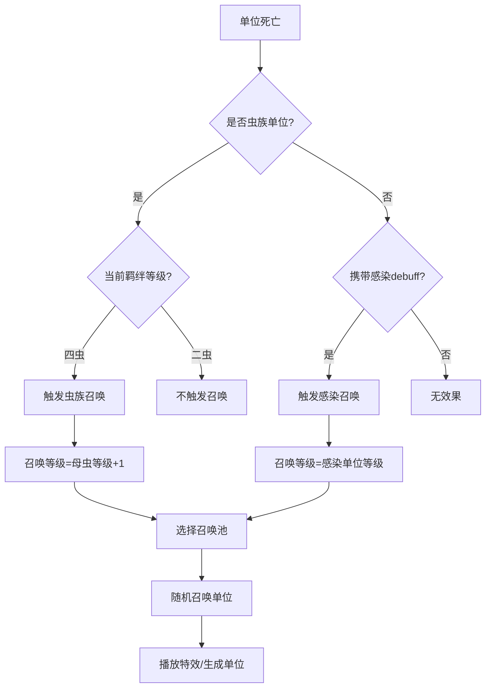
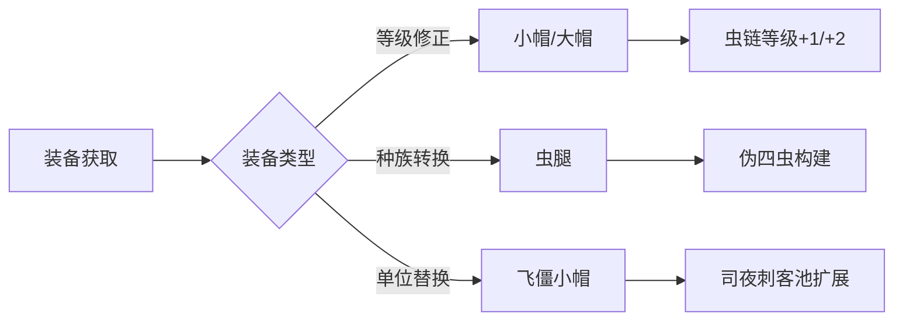
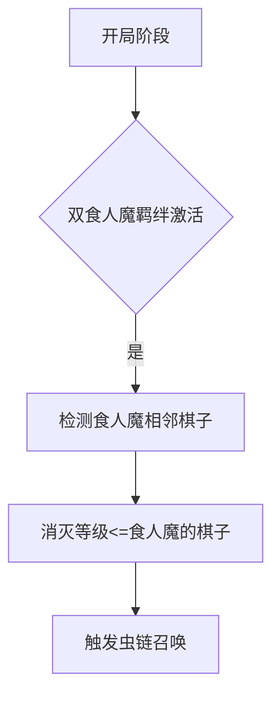
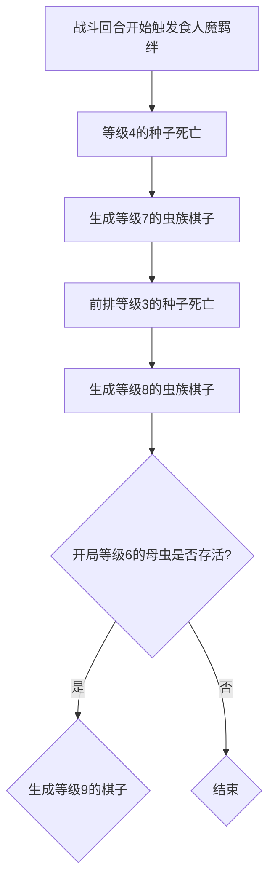

# <center>刀塔自走棋虫体系拆解</center>


## 一 核心机制拆解


### 1.1 基础规则


#### 羁绊介绍


| 玩家常用术语 | 指代对象             |
| ------------ | -------------------- |
| 母虫         | 存活同名最高星级单位 |
| 种子         | 通常为一星虫族单位   |


#### 代码分析


##### 触发条件判断

```lua
local max_level,max_level_chess 
		if u:HasAbility('is_aqir') == true then
			max_level,max_level_chess = GetSameNameFriendChessMaxLevel(u)
		else
			max_level,max_level_chess = GetSameNameFriendChessMaxLevel(u,'modifier_is_aqir_buff')
		end
```


**核心规则**

- 4虫效果仅作用于虫族本体单位
- 2虫效果需要非虫族友方棋子，通过给棋子添加 **‘modifier_is_aqir_buff’ ** 实现


##### **召唤等级计算**

```lua
if u:HasAbility('is_aqir') == true then --四虫
   max_level = max_level + 1  
   --plus_per = 0.07 * 幸运值系数  
   --if RandomFloat(0,1) < plus_per then
   -- max_level = max_level +1
   end
else --二虫
   max_level = max_level
end
if max_level > 9 then
	max_level = 9
end
```


四虫羁绊在游戏内文字介绍的 **更加强壮** 是指 **虫族种子** 召唤出的虫族棋子等级+1（旧版本的幸运值系数已删除，改为固定值）

二虫等级无影响，最后限定了最高召唤的棋子等级为9


##### **召唤单位池**


```lua
local random_pool = AQIR_CHESS_LIST[max_level]
local random_aqir = random_pool[RandomInt(1,table.maxn(random_pool))]
local aqir_level = GetChessNameStar(random_aqir)
```


从预设的虫族单位池中，根据当前召唤等级选取对应的可召唤单位列表


#### 棋子等级

根据棋子等级
$$
Lv = BaseCost + 2*(Star-1) - Modifier
$$


##### 虫族棋子对应等级


#### 


### 1.2 虫体系召唤机制流程
 
    



------

## **二、相关装备拆解**


### 2.1 核心装备


**飞僵小帽(亡灵帽)**


**核心机制**：  

- 种族转换：将1星紫卡永久转换为司夜刺客（虫族+亡灵双种族）  

- 羁绊构建：快速达成四虫羁绊  

  

**使用场景**：

- 中期(R11-20)关键转型期


**无知小帽  (小帽)**


**核心机制**：  

- 等级跃迁：携带棋子自身等级+1

- 虫链速成：提前2-5回合达到阵容强度阈值

  

**使用场景**：

- 装备给低等级的虫族棋子：剧毒/沙王 ，替代蜘蛛


**食人魔之帽（大帽）**


**核心机制**：  

- 等级覆盖：携带棋子自身等级+2 ，和小帽同时装备效果只取最高值

- 后期补强：提升阵容强度至决赛强度

  

**使用场景**：

- 后期配合二星主力橙卡，阵容质量大幅度增强

  


**网虫腿（虫腿）**


**核心机制**：  

- 伪四虫构建：节省棋子数量提供同样羁绊效果

- 新棋子引入虫链：提升阵容后期更高上限和可玩性

  

**使用场景**：

- 中期获取此装备达成二虫/四虫羁绊


### 2.2 装备作用机制





- 版本数据对比（选取率/胜率/平均排名）
- 强度拐点定位（关键等级/装备组合）
- 经济系统影响评估

------


## **三、虫链机制深度解析**


### 3.1 相关概念简析


最能体现虫体系特色的是四虫阵容，此处需要引入食人魔羁绊





### 3.2 虫链核心循环





##### 实战例子


##### **虫链演化路径**

| 阶段 | 目标单位          | 核心操作         | 风险节点                        |
| ---- | ----------------- | ---------------- | ------------------------------- |
| 开局 | 三星剧毒/沙王     | 精准食人魔站位   | 站位出错                        |
| 中期 | 三星蜘蛛/小强     | 保护过渡单位存活 | 敌方AOE爆发将母虫和种子同时消灭 |
| 后期 | 三星蜘蛛/三星橙卡 | 原有的母虫不阵亡 | 敌方输出过高，母虫提前死亡      |

------


## 四、版本环境适配度

#### 4.1 版本生态定位

当前版本（2025.2）虫体系处于T1.5-T2梯队，具备以下环境适配特征：

- **运营窗口期**：虫族强势期是20回合-30回合，进入大后期绝对战力不足
- **装备依赖度**：网虫腿/小帽决定阵容中期强度，大帽决定阵容后期强度
- **阵容克制链**：对爆发型阵容压制力强（刺客，五龙），但惧怕坦度高的阵容（九战）

#### 4.2版本环境适配度

**优势环境要素**：

- 当前版本平均对局时长缩短，对局节奏快（避免对局拖到大后期）
- 网虫腿从T3装备降级为T2装备

**劣势环境要素**：

- 百戏大王依然是虫体系克星(技能是对非永久棋子造成百分比秒伤)，敌方单卡二星后需要更换羁绊
- 四牧师出场率增高（精控断虫链）
- 萨满的出场率增高，劣势阵容增多

#### 4.3 克制关系矩阵

| 对手阵容 | 应对策略               | 胜率预期 |
| -------- | ---------------------- | -------- |
| 五龙     | 增加种子避免虫链被破坏 | 53%      |
| 九战     | 选取破甲和续航装备     | 42%      |
| 金光地精 | 转型舍弃虫体系         | 37%      |

#### 4.4 环境梯度匹配表

| 回合阶段  | 适配阵容      | 强度评级 | 关键节点           |
| --------- | ------------- | -------- | ------------------ |
| 16-25回合 | 胖虫过渡期    | ★★★☆☆    | 21回合尽量启动四虫 |
| 26-30回合 | 完全体胖虫    | ★★★★★    | 至少保留2个种子位  |
| 30+回合   | 橙虫/四虫混搭 | ★★★★☆    | 二星飞机/斯温核心  |

#### 

------

## **五、平衡性调整提案**


### 5.1 短期方案


#### 数值微调建议

- 延长召唤虫棋子的存活时间
- 削弱百戏大王对非永久棋子的百分比秒伤

- 禁用组合预案

  

### 5.2 长期方案


##### 扩展性设计预留

引入DOTA2英雄 **编织者** 新增六虫种族效果

方案①

所有受感染的友方棋子阵亡后产生的虫族棋子有概率获得感染状态

方案②

所有受感染的友方棋子阵亡后产生的虫族棋子有概率增加，70%概率数量+1，30%概率数量＋2

------


